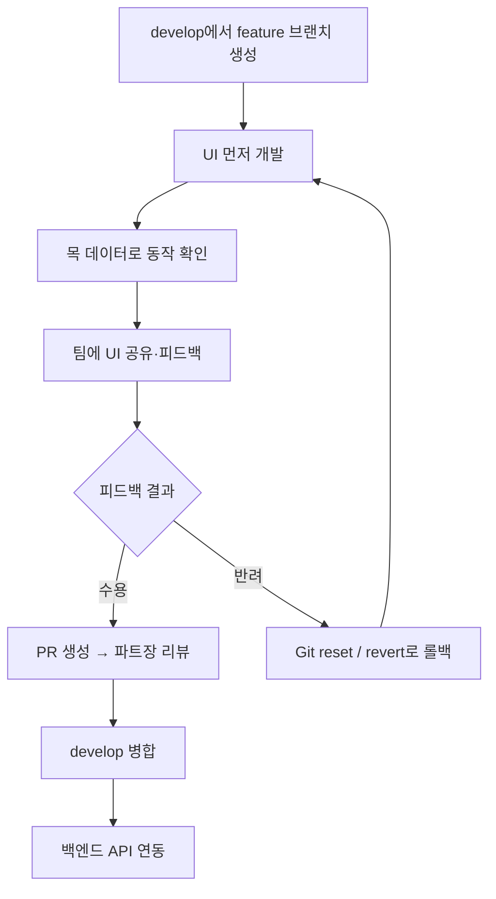

# 협업 규칙서 (Contributing Guide)

세종대학교 교내 중고거래 플랫폼 프론트엔드 팀의 **공식 협업 규칙**입니다.  
모든 팀원은 작업 전 본 문서를 숙지하고, 아래 규칙을 준수해야 합니다.

> 프로젝트 개요·설치 방법은 [README.md](./README.md)를 참고하세요.

---

## 목차

1. [브랜치 규칙](#1-브랜치-규칙)
2. [커밋 메시지 컨벤션](#2-커밋-메시지-컨벤션)
3. [UI-First 개발 프로세스](#3-ui-first-개발-프로세스)
4. [피드백·PR·병합 프로세스](#4-피드백pr병합-프로세스)
5. [Git Rollback 프로세스](#5-git-rollback-프로세스)
6. [금지 사항 요약](#6-금지-사항-요약)

---

## 1. 브랜치 규칙

본 프로젝트는 **Git Flow**를 베이스로 운영합니다.

### 브랜치 구조

| 브랜치 | 용도 | 직접 push |
|--------|------|-----------|
| `master` | 배포 가능한 안정 버전 | ❌ (파트장·팀장만, 릴리스 시) |
| `develop` | 통합 개발 브랜치 | ❌ **엄격히 금지** |
| `feature/*` | 기능·페이지 단위 작업 | ✅ (본인 feature 브랜치만) |

### 작업 시작 절차 (필수)

모든 작업은 **반드시** `develop`에서 `feature/기능명` 브랜치를 생성한 뒤 진행합니다.

```bash
# 1. develop 최신화
git checkout develop
git pull origin develop

# 2. feature 브랜치 생성
git checkout -b feature/기능명

# 예시
git checkout -b feature/login-ui
git checkout -b feature/product-list-grid
git checkout -b feature/chat-window
```

### feature 브랜치 네이밍

- 소문자·하이픈(`-`) 사용
- 역할·페이지·기능이 드러나게 작성

```
feature/login-ui
feature/product-card
feature/mypage-profile
feature/chat-message-input
```

### ⛔ develop 직접 push 금지

| 행위 | 허용 여부 |
|------|-----------|
| `feature/*` 브랜치에 push | ✅ |
| `develop`에 직접 push | ❌ **엄격히 금지** |
| `develop`에 로컬에서 merge 후 push | ❌ **엄격히 금지** |
| `develop` 반영 | ✅ **PR을 통해서만** (파트장 리뷰·병합) |

`develop`은 **Pull Request(PR) → 리뷰 → 승인 → 병합** 경로로만 갱신합니다.  
예외 없이 적용하며, 실수로 push한 경우 즉시 팀에 공유하고 [Git Rollback 프로세스](#5-git-rollback-프로세스)를 따릅니다.

---

## 2. 커밋 메시지 컨벤션

[Conventional Commits](https://www.conventionalcommits.org/) 스타일을 따릅니다.

### 형식

```
<타입>: <한 줄 요약>

[선택] 본문 — 변경 이유, 스크린샷 링크, 이슈 번호
```

### 허용 타입

| 타입 | 사용 시점 | 예시 |
|------|-----------|------|
| `feat` | 새 기능·화면·라우트 추가 | `feat: 상품 목록 그리드 UI 추가` |
| `fix` | 버그 수정 | `fix: 채팅 입력창 전송 버튼 비활성화 오류 수정` |
| `docs` | 문서만 변경 (README, CONTRIBUTING 등) | `docs: CONTRIBUTING 롤백 절차 보완` |
| `style` | 로직 변경 없는 UI·포맷 수정 | `style: 로그인 폼 버튼 간격 조정` |
| `refactor` | 동작 동일, 구조·이름 정리 | `refactor: ProductList API 호출 로직 분리` |
| `revert` | **롤백** — 이전 커밋 되돌릴 때 | `revert: feat: 채팅 레이아웃 2단 구조 적용` |

### `revert` 태그 (롤백 전용)

피드백 반려 등으로 코드를 되돌릴 때는 반드시 `revert` 타입을 사용합니다.

```bash
# git revert 실행 시 자동 생성되는 메시지 예시
revert: feat: 마이페이지 탭 메뉴 추가

This reverts commit a1b2c3d4.
```

수동 커밋 시에도 동일하게 작성합니다.

```
revert: fix: 헤더 네비게이션 활성 상태 스타일

피드백 반려 — develop 병합 전 로컬에서 reset 후 재작업
```

### 작성 규칙

- 제목은 **50자 이내**, 명령형·현재형 (`추가`, `수정`, `제거`)
- 타입과 콜론 뒤 공백 한 칸: `feat: ...`
- 한 커밋에 한 가지 목적
- UI 변경 시 PR 본문에 스크린샷 첨부 권장

### 좋은 예 / 나쁜 예

```
✅ feat: ProductList 목 데이터 폴백 처리 추가
✅ revert: style: 채팅 버블 색상 emerald로 변경
❌ 수정함
❌ WIP
❌ asdfasdf
```

---

## 3. UI-First 개발 프로세스

본 팀은 **사전 기획서 없이 프론트엔드가 UI를 먼저 개발**하는 **UI-First** 방식을 사용합니다.

### 왜 UI-First인가?

- 화면을 먼저 보며 요구사항·피드백을 빠르게 수렴
- 백엔드 API 스펙을 **확정된 UI**를 기준으로 설계
- Ctrl+Z·임시 수정이 아닌 **Git으로 이력을 관리**하는 연습

### 전체 흐름



### 단계별 가이드

#### Step 1 — UI 먼저 개발 (기획서 없이)

- Figma·기획 문서 **없이**도 작업 시작 가능
- `src/pages/{도메인}/` 아래에 뷰·컴포넌트 구현
- API는 `api.js`에 함수만 정의하고, **목(mock) 데이터**로 화면 완성

```jsx
// 예: API 미연동 시 목 데이터로 UI 검증
const MOCK_PRODUCTS = [ /* ... */ ]

try {
  const data = await fetchProducts()
  setProducts(data?.items ?? [])
} catch {
  setProducts(MOCK_PRODUCTS) // UI 검증용
}
```

#### Step 2 — 팀에 UI 공유

- 개발 서버(`npm run dev`) 또는 PR 초안·스크린샷으로 공유
- 공유 시 포함할 내용:
  - 어떤 페이지/기능인지
  - 확인이 필요한 UX 포인트 (버튼, 레이아웃, 빈 상태 등)
  - 알려진 제한사항 (API 미연동 등)

#### Step 3 — 피드백 수렴

- 팀장·프론트 파트장·팀원 피드백을 이슈·PR 코멘트·회의로 정리
- **수용** / **반려** 를 명확히 구분

| 결과 | 다음 행동 |
|------|-----------|
| **수용** | [피드백·PR·병합 프로세스](#4-피드백pr병합-프로세스)로 이동 |
| **반려** | [Git Rollback 프로세스](#5-git-rollback-프로세스)로 이동 — **Ctrl+Z 사용 금지** |

---

## 4. 피드백·PR·병합 프로세스

### 피드백이 **수용**된 경우

1. `feature/*` 브랜치에서 피드백 반영 후 커밋
2. 원격에 push
3. **프론트엔드 파트장**에게 `develop` 대상 **PR 생성**
4. 파트장 리뷰 → 수정 요청 시 추가 커밋 → **Approve**
5. 파트장이 `develop`에 **병합** (본인이 develop에 직접 push하지 않음)

#### PR 작성 체크리스트

- [ ] `develop` ← `feature/기능명` 방향
- [ ] 커밋 메시지 컨벤션 준수
- [ ] UI 변경 시 **Before/After 스크린샷**
- [ ] `npm run build` 통과
- [ ] 목 데이터 사용 시 PR 본문에 명시

#### PR 제목 예시

```
feat: 상품 목록 ProductGrid UI 및 목 데이터 연동
fix: 채팅방 선택 시 메시지 미표시 오류 수정
```

### 병합 권한

| 역할 | develop 병합 |
|------|----------------|
| 프론트엔드 파트장 | ✅ |
| 프론트엔드 팀원 | ❌ (PR만 생성) |
| 팀장 / 백엔드 | ❌ (리뷰·코멘트만) |

---

## 5. Git Rollback 프로세스

피드백이 **반려**되었을 때, 에디터의 **Ctrl+Z(실행 취소)로 덮어쓰지 않습니다.**  
반드시 Git 명령으로 **이전 커밋 상태**로 되돌린 뒤 다시 작업합니다.  
이는 버전 관리 역량을 키우기 위한 **팀 공통 훈련 규칙**입니다.

### 어떤 명령을 쓸지 판단

```
피드백 반려 → 롤백 필요
        │
        ├─ 아직 push 안 함 (로컬만)
        │       └─► git reset --hard
        │
        └─ 이미 push 함 (원격 feature 또는 develop)
                └─► git revert
```

| 상황 | 명령 | 이유 |
|------|------|------|
| 로컬 커밋만 있고 push 전 | `git reset --hard` | 작업 트리·커밋을 특정 시점으로 완전 복원 |
| 원격에 이미 push | `git revert` | 공유 히스토리를 안전하게 되돌림 |

---

### 5-1. 로컬 롤백: `git reset --hard`

**push 하기 전**, 반려된 작업을 통째로 되돌릴 때 사용합니다.

#### 마지막 커밋 1개 제거

```bash
git reset --hard HEAD~1
```

#### 특정 커밋 시점으로 되돌리기

```bash
# 되돌아갈 커밋 해시 확인
git log --oneline

# 해당 커밋으로 작업 디렉터리·스테이징·커밋 모두 복원
git reset --hard <커밋해시>
```

#### 반려 후 재작업 예시

```bash
# 1. 반려 직전의 안정 커밋으로 복원
git reset --hard HEAD~1

# 2. UI를 처음부터 다시 구현
# 3. 새 커밋 (기존과 다른 메시지 권장)
git add .
git commit -m "feat: 상품 카드 레이아웃 피드백 반영하여 재구현"

# 4. feature 브랜치에 push
git push origin feature/product-card
```

> **주의:** `--hard`는 **저장하지 않은 변경·커밋이 모두 삭제**됩니다.  
> 되돌리기 전 `git log --oneline`으로 해시를 기록해 두세요.

---

### 5-2. 원격 롤백: `git revert`

**이미 `git push`한 커밋**을 되돌릴 때 사용합니다.  
히스토리를 지우지 않고 **되돌리는 새 커밋**을 만듭니다.

#### 단일 커밋 되돌리기

```bash
# 되돌릴 커밋 해시 확인
git log --oneline

# revert 커밋 생성 (에디터에서 메시지 저장)
git revert <되돌릴_커밋해시>

# 커밋 메시지는 revert 타입 준수
# revert: feat: 채팅 2단 레이아웃 적용

git push origin feature/기능명
```

#### 여러 커밋 되돌리기

```bash
# 최신 커밋부터 순서대로 revert (충돌 시 해결 후 계속)
git revert <커밋해시1>
git revert <커밋해시2>

git push origin feature/기능명
```

#### develop에 잘못 merge된 경우 (파트장)

```bash
git checkout develop
git pull origin develop
git revert <잘못_병합된_커밋_또는_merge_commit>
git push origin develop
```

팀원은 **develop 직접 push 금지**이므로, develop revert는 파트장이 수행합니다.

---

### 5-3. Ctrl+Z를 쓰지 않는 이유

| 방식 | 문제 |
|------|------|
| Ctrl+Z / 수동 삭제 | Git 이력에 남지 않음, 팀과 상태 공유 불가 |
| `git reset --hard` | 로컬 이력이 명확, 같은 실수 재현·학습 가능 |
| `git revert` | 원격 이력 보존, 누가·언제·무엇을 되돌렸는지 추적 가능 |

반려 → 롤백 → 재작업의 전 과정이 커밋 로그에 남아야 **코드 리뷰·팀 학습**에 도움이 됩니다.

---

### 5-4. 롤백 시나리오별 치트시트

| 시나리오 | 명령 |
|----------|------|
| 방금 한 커밋이 마음에 안 듦 (push 전) | `git reset --hard HEAD~1` |
| 3커밋 전 상태로 돌아가고 싶음 (push 전) | `git reset --hard HEAD~3` |
| 특정 커밋만 취소 (이미 push) | `git revert <해시>` + push |
| PR 머지 후 develop 문제 (파트장) | `git revert <merge_commit>` on develop |

---

## 6. 금지 사항 요약

| # | 금지 행위 | 대안 |
|---|-----------|------|
| 1 | `develop`에 직접 push | `feature/*` → PR → 파트장 병합 |
| 2 | `master`에 직접 push | 릴리스 시 파트장·팀장만, develop 경유 |
| 3 | 피드백 반려 시 Ctrl+Z만으로 수정 | `git reset --hard` 또는 `git revert` |
| 4 | 컨벤션 없는 커밋 메시지 | `feat:`, `fix:`, `revert:` 등 타입 사용 |
| 5 | `develop`에서 feature 없이 작업 | 반드시 `feature/기능명` 브랜치 생성 |
| 6 | 공유 브랜치에 `reset --hard` 후 force push | `git revert` 사용 |

---

## 빠른 참조

```bash
# 작업 시작
git checkout develop && git pull origin develop
git checkout -b feature/내-기능

# 작업·커밋·push
git add .
git commit -m "feat: 내 기능 설명"
git push origin feature/내-기능

# 반려 — 로컬만 (push 전)
git reset --hard HEAD~1

# 반려 — 이미 push
git revert <해시>
git push origin feature/내-기능

# 수용 — PR 후 파트장이 develop 병합
```

---

문의·규칙 개선 제안은 프론트엔드 파트장 또는 팀장에게 전달해 주세요.
